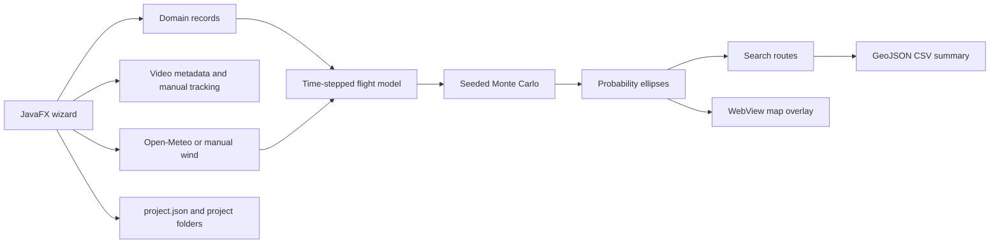
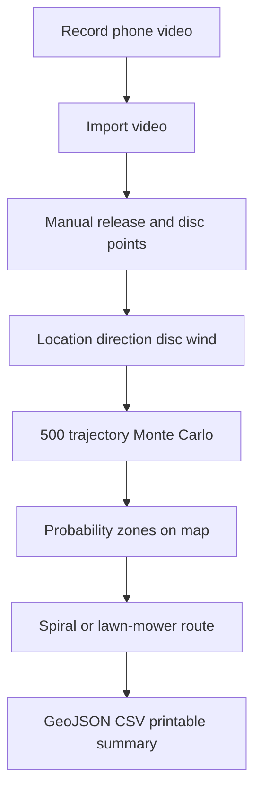
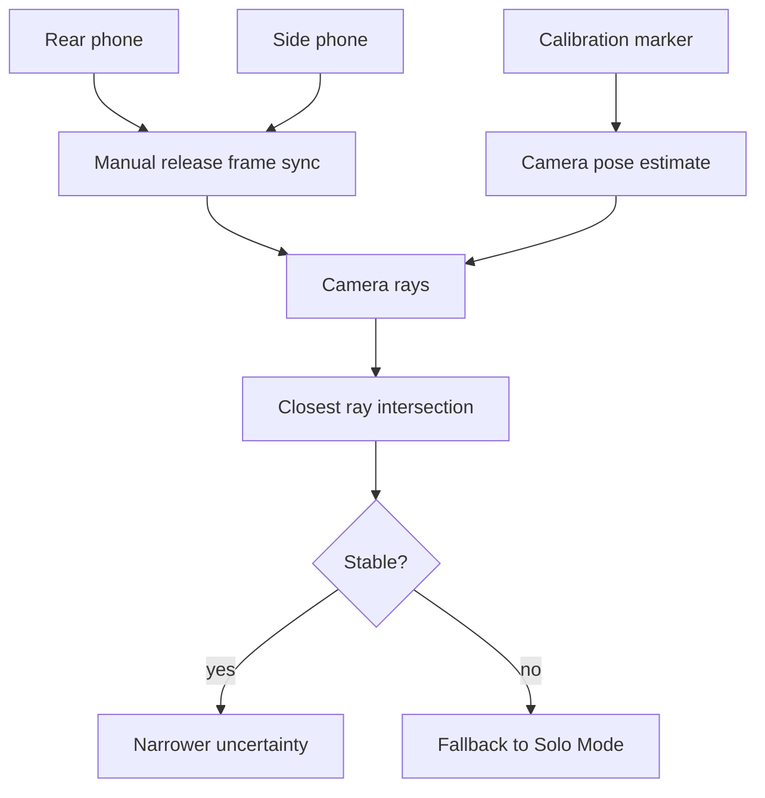
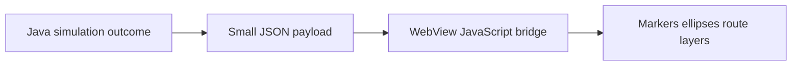
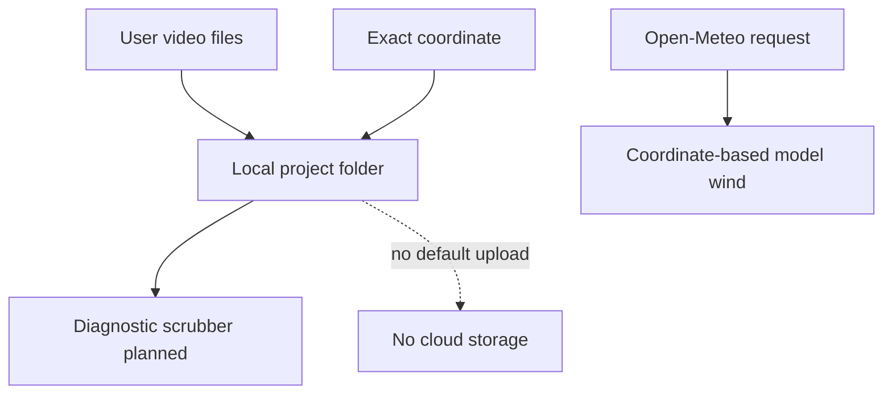

# Architecture

```mermaid
flowchart LR
  UI[JavaFX wizard] --> Domain[Domain records]
  UI --> Video[Video metadata and manual tracking]
  UI --> Weather[Open-Meteo or manual wind]
  Domain --> Physics[Time-stepped flight model]
  Weather --> Physics
  Physics --> MonteCarlo[Seeded Monte Carlo]
  MonteCarlo --> Probability[Probability ellipses]
  Probability --> Search[Search routes]
  Search --> Export[GeoJSON CSV summary]
  Probability --> Map[WebView map overlay]
  UI --> Persistence[project.json and project folders]
```

```mermaid
flowchart TD
  Record[Record phone video] --> Import[Import video]
  Import --> Mark[Manual release and disc points]
  Mark --> Inputs[Location direction disc wind]
  Inputs --> Sim[500 trajectory Monte Carlo]
  Sim --> Map[Probability zones on map]
  Map --> Route[Spiral or lawn-mower route]
  Route --> Export[GeoJSON CSV printable summary]
```

```mermaid
flowchart TD
  Rear[Rear phone] --> Sync[Manual release frame sync]
  Side[Side phone] --> Sync
  Marker[Calibration marker] --> Pose[Camera pose estimate]
  Sync --> Rays[Camera rays]
  Pose --> Rays
  Rays --> Triangulation[Closest ray intersection]
  Triangulation --> Valid{Stable?}
  Valid -->|yes| Narrow[Narrower uncertainty]
  Valid -->|no| Solo[Fallback to Solo Mode]
```

```mermaid
flowchart LR
  Java[Java simulation outcome] --> JSON[Small JSON payload]
  JSON --> WebView[WebView JavaScript bridge]
  WebView --> Overlay[Markers ellipses route layers]
```

```mermaid
flowchart TD
  Media[User video files] --> Local[Local project folder]
  GPS[Exact coordinate] --> Local
  Local --> Scrub[Diagnostic scrubber planned]
  Local -. no default upload .-> Cloud[No cloud storage]
  Weather[Open-Meteo request] --> Approx[Coordinate-based model wind]
```
